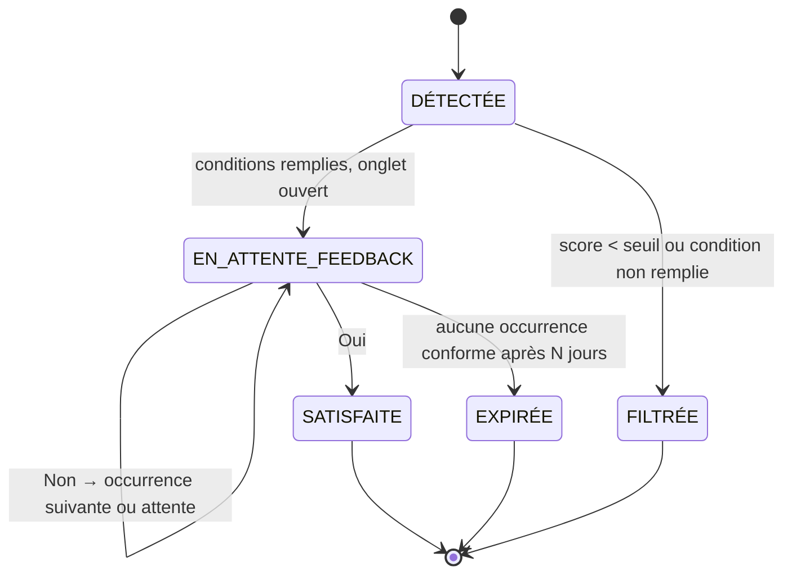

# Spécification Fonctionnelle — Agent de Veille Web Autonome (AVW)

**Version** : 1.4
**Date** : 23/08/2026
**Statut** : à valider
**Périmètre** : recherche et surveillance d'information sur le Web uniquement

> **Évolutions v1.1** : typologie de veilles généralisée (l'agent n'est lié à aucun domaine) · étape obligatoire de validation de la directive avant exécution · service d'arrière-plan autonome fonctionnant navigateur fermé · notifications Windows natives · plafond d'ouvertures restreint aux veilles en source large · portée du refus limitée à la Cible courante.
>
> **Évolutions v1.2** : conditions de disponibilité de la machine explicitées (éteinte, en veille, session verrouillée) et politique de rattrapage associée · fréquence plancher fixée à 5 minutes · lancement du navigateur autorisé sans restriction horaire dès lors que la session est ouverte.
>
> **Évolutions v1.3** : reprise à l'état après absence, sans reconstitution rétroactive de l'historique des sources · filtre de péremption pour les patrons non persistants.
>
> **Évolutions v1.4** : annexe technique (§12) — stack retenue, périmètre navigateur, découpage du Lot 1 en jalons vérifiables, points de vigilance.

---

## 1. Contexte et objectifs

### 1.1 Problème adressé
L'utilisateur consacre du temps récurrent à vérifier manuellement si une information est parue : sortie d'un contenu attendu, résultat d'un événement, actualité sur un sujet, mise à jour d'une page, apparition d'une offre. Ce travail est répétitif, à faible valeur, et génère du bruit (mêmes informations répétées sur plusieurs sites).

### 1.2 Objectif produit
Fournir un agent qui, en tâche de fond et **sans que le navigateur soit ouvert** :
1. mémorise **un nombre illimité de demandes de veille**, de nature quelconque et simultanées ;
2. **confirme sa compréhension** de chaque demande avant de l'exécuter ;
3. surveille soit des **sources choisies par l'utilisateur**, soit **le Web au sens large** (choix veille par veille) ;
4. **ouvre automatiquement** la page trouvée dans un onglet en arrière-plan, accompagnée d'une **notification Windows** ;
5. **apprend des retours** de l'utilisateur (toggle Oui/Non) pour ne jamais répéter la même information et pour améliorer l'ordre de consultation des sources.

### 1.3 Principe directeur : neutralité de domaine
**L'agent ne connaît aucun domaine métier en propre.** Les besoins cités en exemple (scans de manga, préparation de voyage, résultats sportifs, résultats de loterie, prix, offres) ne sont pas des fonctionnalités : ce sont des **instances** de patrons de veille génériques. Toute nouvelle demande exprimée en langage naturel doit pouvoir être prise en charge sans développement spécifique. Une fonctionnalité qui ne serait utile qu'à un seul domaine est, par construction, hors spécification.

### 1.4 Objectifs mesurables (cibles v1)
| Indicateur | Cible |
|---|---|
| Délai entre publication réelle et notification | < 15 min (veille à source ciblée) |
| Taux de pertinence (feedback « Oui » / total ouvertures) | > 70 % après 4 semaines d'usage |
| Doublons ouverts après validation d'une information | 0 |
| Onglets ouverts par jour en mode source large | ≤ 10 (plafond utilisateur) |
| Directives mal interprétées détectées avant exécution | > 90 % (grâce à l'étape de validation) |

### 1.5 Hors périmètre (v1)
- Toute action transactionnelle : achat, réservation, pari, remplissage de formulaire, publication, envoi de message. **L'agent informe, il n'agit jamais à la place de l'utilisateur.**
- Téléchargement, copie ou stockage local du contenu des pages : l'agent ouvre la page à sa source.
- Contournement de paywall, de CAPTCHA, d'authentification ou de mesure technique de protection.
- Veille sur des canaux non web (messageries, applications natives, boîte mail).
- Application mobile ; support macOS/Linux (v1 ciblée Windows pour la partie service et notifications).

---

## 2. Concepts et vocabulaire

| Terme | Définition |
|---|---|
| **Directive** | Le texte en langage naturel par lequel l'utilisateur exprime son besoin. C'est l'unique entrée obligatoire d'une veille. |
| **Interprétation** | La traduction structurée de la Directive par l'agent, soumise à validation explicite avant toute exécution. |
| **Veille** (*Watch*) | Une demande persistante, issue d'une Directive validée. |
| **Source** | Un site, une section, un flux, ou un moteur interrogé pour une veille. |
| **Cible** (*Target*) | L'unité d'information attendue, identifiée de façon unique. Ex. : « One Piece – ch. 1191 – VF », « Tirage Loto du 21/08 », « OL–PSG du 24/08 : résultat final ». |
| **Occurrence** (*Hit*) | Le couple (Cible × Source) : la même Cible trouvée sur un site donné. Une Cible a N Occurrences. |
| **Condition de déclenchement** | La règle qui fait passer une Occurrence du statut « détectée » à « à ouvrir ». Par défaut : la nouveauté. Peut être enrichie (seuil, valeur, statut). |
| **Ouverture** | L'action d'ouvrir un onglet en arrière-plan sur une Occurrence, avec notification Windows et overlay de feedback. |
| **Feedback** | Réponse Oui/Non de l'utilisateur sur une Occurrence ouverte. |

---

## 3. Architecture fonctionnelle

```
┌───────────────────────────────────────────────────────────────┐
│  M1 · Gestion des veilles          (cycle de vie, catalogue)   │
│  M2 · Directive : interprétation et VALIDATION préalable       │
│  M3 · Configuration des sources    (ciblé / large / hybride)   │
├───────────────────────────────────────────────────────────────┤
│  M4 · Collecteur                   (planification, crawl)      │
│  M5 · Extracteur                   (normalisation)             │
│  M6 · Identification & déduplication                           │
│  M7 · Moteur de pertinence & conditions de déclenchement       │
├───────────────────────────────────────────────────────────────┤
│  M8 · Orchestrateur d'ouverture    (file, priorité, quotas)    │
│  M9 · Overlay de feedback          (toggle Oui/Non + motif)    │
│  M10 · Apprentissage               (scores de sources, profil) │
├───────────────────────────────────────────────────────────────┤
│  M11 · Historique & tableau de bord                            │
│  M12 · Service d'arrière-plan & intégration Windows            │
│  M13 · Paramètres, garde-fous, conformité                      │
└───────────────────────────────────────────────────────────────┘
```

**Support cible** : un **service local Windows** (collecte autonome, navigateur fermé) + une **extension de navigateur** (ouverture d'onglets, injection de l'overlay de feedback) + une **interface de pilotage** (application de bureau ou page locale).

---

## 4. Spécifications détaillées par module

### M1 — Gestion des veilles

**F1.1** L'utilisateur peut créer un nombre illimité de veilles, indépendantes les unes des autres, sur **n'importe quel sujet**.

**F1.2** Une veille est décrite par :

| Champ | Obligatoire | Origine | Description |
|---|---|---|---|
| Directive | Oui | Utilisateur | Le besoin en langage naturel |
| Nom | Oui | Proposé par l'agent | Libellé court, modifiable |
| Patron de veille | Oui | Déduit, validé | Voir F1.3 |
| Mode de sources | Oui | Utilisateur | `CIBLÉ` \| `LARGE` \| `HYBRIDE` |
| Critères d'acceptation | Oui | Déduits, validés | Ce qui rend un résultat conforme (langue, complétude, format, périmètre…) |
| Condition de déclenchement | Oui | Déduite, validée | Par défaut : nouveauté. Sinon : seuil, valeur, statut |
| Fréquence de vérification | Oui | Proposée | Prédéfinie, personnalisée ou adaptative |
| Fenêtre active | Non | Utilisateur | Plages horaires/jours d'ouverture autorisée |
| Mode de restitution | Oui | Utilisateur | `ONGLET_ARRIÈRE_PLAN` (défaut) \| `NOTIFICATION_SEULE` \| `FILE_D'ATTENTE` \| `DIGEST` |
| Date de fin | Non | Utilisateur | Archivage automatique |
| Statut | Oui | Système | `BROUILLON` \| `À_REVALIDER` \| `ACTIVE` \| `EN_PAUSE` \| `ARCHIVÉE` |

**F1.3 — Patrons de veille (typologie extensible).** L'agent classe chaque Directive dans l'un des patrons suivants, qui définissent son comportement de détection. Cette liste est un **socle**, conçu pour couvrir tout besoin d'information web ; elle doit pouvoir s'enrichir sans refonte.

| Patron | Ce que l'agent attend | Exemples (non limitatifs) |
|---|---|---|
| `SORTIE_SÉRIELLE` | Un nouvel élément d'une suite numérotée ou datée ; l'agent déduit et incrémente l'élément attendu | Chapitre de manga, épisode, numéro de revue, version logicielle, saison |
| `RÉSULTAT_ÉVÉNEMENTIEL` | Le résultat d'un événement dont la date est connue à l'avance | Résultats sportifs, tirage de loterie, élection, publication de notes d'examen, résultats financiers |
| `ACTUALITÉ_THÉMATIQUE` | Toute information nouvelle et pertinente sur un sujet, sans ordre | Actualité d'un pays, d'une entreprise, d'une technologie, d'une personnalité publique |
| `APPARITION_D'OFFRE` | Un nouvel item entrant dans un flux, filtré par critères | Annonce immobilière, offre d'emploi, billetterie, petite annonce, appel d'offres |
| `SURVEILLANCE_DE_VALEUR` | Le franchissement d'un seuil ou un changement d'état d'une donnée suivie | Prix, disponibilité en stock, cote, taux, indicateur |
| `CHANGEMENT_DE_PAGE` | Toute modification significative d'une URL précise | Page de statut, règlement, page officielle, documentation |

**F1.4** Si aucun patron ne s'applique clairement, l'agent retient `ACTUALITÉ_THÉMATIQUE` par défaut **et le signale explicitement dans son Interprétation** (M2), pour que l'utilisateur puisse corriger.

**F1.5 — Modèles réutilisables.** Toute veille validée peut être enregistrée comme modèle et dupliquée (ex. « suivre une nouvelle série » réutilise la configuration éprouvée d'une série existante). L'agent propose ses modèles lors d'une création ultérieure similaire.

**F1.6** Actions disponibles sur une veille : mettre en pause, reprendre, dupliquer, archiver, supprimer, tester maintenant, simuler (M2).

**F1.7** Le tableau de bord n'impose aucune arborescence par domaine. L'utilisateur organise ses veilles par **étiquettes libres** (ex. « loisirs », « voyage », « finances »).

---

### M2 — Directive : interprétation et validation préalable

> **Principe non négociable : l'agent ne collecte rien avant validation explicite de son Interprétation.** Une veille créée reste en statut `BROUILLON`. Aucune requête réseau, aucune ouverture d'onglet.

**F2.1 — Saisie.** L'utilisateur rédige sa Directive en texte libre, sans formalisme imposé. Il y exprime ce qu'il veut, avec ses propres termes (« VF », « VA », « scan », « résultat définitif », « uniquement le tirage du vendredi »…). L'agent **ne réécrit ni ne normalise le vocabulaire de l'utilisateur** : il le reprend tel quel dans son Interprétation.

**F2.2 — Fiche d'interprétation.** À la soumission, l'agent produit une reformulation structurée, lisible sans jargon, comportant :

1. **Ce que j'ai compris** : objet surveillé, périmètre, patron de veille retenu et pourquoi.
2. **Critères d'acceptation** : ce qui fera qu'un résultat sera considéré comme conforme.
3. **Condition de déclenchement** : ce qui, précisément, provoquera une ouverture d'onglet.
4. **Ce que je vais faire concrètement** : sources retenues ou stratégie de recherche, fréquence, horaires.
5. **Exemples discriminants** : deux ou trois cas qui **déclencheraient** une ouverture, et deux ou trois cas qui ne la déclencheraient **pas**. C'est le meilleur révélateur d'un malentendu.
6. **Mes hypothèses** : tout ce que l'agent a comblé de lui-même, signalé comme tel.
7. **Mes questions** : au maximum 3 points d'ambiguïté réellement bloquants, avec réponses suggérées en un clic.

**F2.3 — Validation.** Trois actions possibles :
- **Valider et activer** → la veille passe `ACTIVE`, la collecte démarre.
- **Corriger** → l'utilisateur amende la Directive ou modifie directement un champ de la fiche ; l'agent régénère son Interprétation ; nouveau cycle de validation.
- **Simuler d'abord** → voir F2.4.

**F2.4 — Simulation à blanc (*dry run*).** Sur demande, l'agent exécute un cycle complet **sans rien ouvrir** et présente ce qu'il **aurait** ouvert sur la période récente (jusqu'aux N derniers jours), avec pour chaque résultat le score et la règle appliquée. L'utilisateur juge sur pièces avant d'activer. Recommandé pour toute veille en mode `LARGE`.

**F2.5 — Revalidation.** Toute modification ultérieure d'un champ structurant (Directive, patron, critères d'acceptation, condition de déclenchement, mode de sources) fait basculer la veille en `À_REVALIDER` et **suspend la collecte** jusqu'à nouvelle validation. Les modifications de confort (nom, étiquettes, fréquence, fenêtre active, plafond) ne déclenchent pas de revalidation.

**F2.6 — Dérive détectée.** Si, après activation, l'agent constate une incohérence forte entre la Directive et le réel (aucun résultat depuis N jours, ou taux de rejet supérieur à 70 % sur 10 ouvertures), il **suspend la veille de lui-même** et propose une Interprétation révisée à valider. Il ne modifie jamais une veille active sans accord.

**F2.7 — Traçabilité.** L'historique conserve toutes les versions successives de la Directive et de l'Interprétation, avec leur date de validation.

---

### M3 — Configuration des sources

**F3.1 — Mode `CIBLÉ`.** L'utilisateur déclare explicitement ses sources (URL de site, de section, ou flux). L'agent n'interroge rien d'autre.
- Ajout par saisie d'URL, import de favoris, ou sélection dans les suggestions de l'agent.
- Chaque source porte un **rang de préférence** modifiable, utilisé pour décider quelle source ouvrir en premier.
- Affichage par source : dernière visite, dernier résultat, taux de validation, statut technique.
- **Aucun plafond d'ouvertures** ne s'applique à ce mode (cf. RG-07).

**F3.2 — Mode `LARGE`.** L'utilisateur ne déclare aucune source ; l'agent construit ses requêtes à partir de la Directive et interroge moteurs, agrégateurs et flux publics.
- Garde-fous paramétrables : domaines exclus, domaines prioritaires, types de sources exclus (forums, réseaux sociaux, agrégateurs, contenus sponsorisés).
- Journalisation systématique des sources utilisées ; promotion vers `CIBLÉ` ou bannissement en un clic.
- **Plafond quotidien d'ouvertures obligatoire** (défaut : 10, cf. RG-07).

**F3.3 — Mode `HYBRIDE`.** Les sources déclarées sont interrogées en priorité ; l'agent élargit au Web si aucune n'a produit de résultat au bout d'un délai paramétrable. Le plafond ne s'applique qu'aux résultats issus de l'élargissement.

**F3.4** Après 3 échecs consécutifs sur une source déclarée (404, blocage, structure modifiée), alerte de maintenance dans le tableau de bord et proposition de remplacement. La veille n'est jamais bloquée par une source défaillante.

**F3.5** L'agent propose spontanément, lors de la configuration, les **sources officielles ou primaires** lorsqu'elles existent pour le besoin exprimé (organisme officiel, éditeur, fédération, service public). L'utilisateur reste libre de les retenir ou non.

---

### M4 — Collecteur

**F4.1** Planification par veille : `Temps réel (5 min)`, `Fréquent (15 min)`, `Horaire`, `Quotidien`, `Hebdomadaire`, `Personnalisé (cron)`.

**F4.1.1 — Fréquence plancher : 5 minutes.** Aucune veille ne peut être planifiée en dessous de ce seuil, y compris en mode `Personnalisé`. Justification : en deçà, le gain de réactivité est marginal au regard du coût (sollicitation des sites, consommation, risque de limitation ou de blocage par les éditeurs — cf. F4.5). La réactivité sur les patrons sensibles au temps est obtenue par le **calage sur le calendrier de l'événement** (F4.2), pas par l'augmentation de la fréquence.

**F4.2 — Planification événementielle.** Pour le patron `RÉSULTAT_ÉVÉNEMENTIEL`, l'agent cale sa surveillance sur le **calendrier de l'événement** plutôt que sur une fréquence fixe : il reste inactif jusqu'à l'heure prévue, puis passe en vérification rapprochée jusqu'à l'obtention du résultat, puis se rendort.
> Exemples : tirage de loterie à heure fixe → surveillance à partir de l'heure du tirage ; match à 21 h → surveillance à partir de 22 h 30 jusqu'au résultat définitif.

**F4.3 — Fréquence adaptative (activée par défaut).** L'agent apprend le rythme de publication observé et resserre sa fréquence autour des fenêtres probables, sans intervention de l'utilisateur.

**F4.4** Méthodes de collecte par ordre de préférence : flux RSS/Atom → sitemap ou API publique → page de listing (comparaison d'empreinte) → moteur de recherche. La méthode la plus stable et la moins coûteuse est retenue automatiquement.

**F4.5 — Politesse technique obligatoire** : respect du `robots.txt`, limitation de débit par domaine (défaut : 1 requête / 10 s), `User-Agent` identifiable, back-off exponentiel sur 429/503.

**F4.6 — Re-contrôle des Occurrences rejetées.** Une Occurrence ayant reçu un « Non » reste surveillée à la fréquence normale de la veille : si son contenu évolue de façon significative (correction, complétion, mise à jour du résultat), l'agent la considère comme une **nouvelle Occurrence** de la même Cible et applique RG-01.

---

### M5 — Extracteur

**F5.1** Pour chaque page candidate, extraction de : titre, URL canonique, date de publication, langue, éditeur, résumé, et **métadonnées structurantes selon le patron** (numéro d'élément, langue de version, score, valeur numérique, statut provisoire/définitif, prix, disponibilité).

**F5.2** Normalisation des variantes de nommage pour permettre la déduplication.
> « One Piece 1191 » / « OP Chapter 1191 » / « One Piece Chapitre 1191 VF » → même élément, versions linguistiques distinctes.
> « Loto — tirage du vendredi 21 août » / « Résultats Loto 21/08/2026 » → même Cible.

**F5.3** Détection du caractère **provisoire ou définitif** d'une information (score en cours vs score final, résultat officiel vs officieux, chiffre estimé vs consolidé). Une information provisoire ne satisfait pas une Cible dont les critères exigent le définitif.

**F5.4** Si la date de publication est absente, l'agent retient la date de première détection en signalant l'incertitude.

---

### M6 — Identification de Cible et déduplication

**F6.1 — Clé de Cible, par patron :**

| Patron | Clé logique |
|---|---|
| `SORTIE_SÉRIELLE` | élément + numéro (+ version linguistique si les critères d'acceptation la distinguent) |
| `RÉSULTAT_ÉVÉNEMENTIEL` | événement + date (+ nature du résultat : provisoire / définitif) |
| `ACTUALITÉ_THÉMATIQUE` | empreinte sémantique de l'événement couvert |
| `APPARITION_D'OFFRE` | identifiant de l'offre, ou empreinte (titre + lieu + prix) pour détecter les multi-diffusions |
| `SURVEILLANCE_DE_VALEUR` | entité suivie + franchissement de seuil |
| `CHANGEMENT_DE_PAGE` | URL + horodatage du changement |

**F6.2** Toute Occurrence est rattachée à une Cible existante ou en crée une nouvelle. Aucune Occurrence n'est traitée hors Cible.

**F6.3** Seuil de regroupement paramétrable sur trois crans : `Strict` (peu de regroupement, plus d'ouvertures) / `Équilibré` (défaut) / `Agressif` (regroupement large, moins d'ouvertures).

**F6.4** Depuis l'historique, l'utilisateur peut **fusionner** deux Cibles identiques ou **scinder** une Cible mal regroupée. Ces corrections alimentent l'apprentissage.

---

### M7 — Pertinence et conditions de déclenchement

**F7.1** Chaque Occurrence reçoit un score de 0 à 100 combinant : correspondance aux critères d'acceptation validés, fraîcheur, score de fiabilité de la source pour cette veille, rang de préférence utilisateur, et pénalités (contenu partiel, version linguistique non demandée, page de redirection ou d'annonce sans le contenu, contenu essentiellement publicitaire, reprise syndiquée).

**F7.2** Une Occurrence n'est ouverte que si **(a)** son score dépasse le seuil de la veille **et (b)** la condition de déclenchement est remplie. Sinon elle est enregistrée en statut `FILTRÉE`, consultable mais silencieuse.

**F7.3** Seuil de pertinence paramétrable par veille : `Tout me montrer` / `Équilibré` (défaut) / `Seulement le très pertinent`.

**F7.4** Les conditions de déclenchement dépassant la simple nouveauté sont exprimées dans la Directive et confirmées en M2.
> « seulement si le prix passe sous 400 € », « seulement le résultat définitif », « seulement les offres à moins de 30 km », « seulement si mon numéro fétiche sort ».

---

### M8 — Orchestrateur d'ouverture (règles de gestion clés)

**RG-01 — Première Occurrence d'une Cible.**
Dès qu'une Cible nouvelle est détectée et que les conditions de F7.2 sont réunies, l'agent ouvre **un seul onglet**, en arrière-plan, sur l'Occurrence au meilleur score, et émet une **notification Windows**. La Cible passe à `EN_ATTENTE_FEEDBACK`.

**RG-02 — Fenêtre de consolidation.**
Si plusieurs sources publient la même Cible dans un intervalle court (défaut : 10 min, paramétrable), l'agent n'ouvre **pas** plusieurs onglets. Il attend la fin de la fenêtre, classe les Occurrences par score, ouvre la meilleure et met les autres `EN_RÉSERVE`.

**RG-03 — Feedback « Oui ».**
La Cible passe à `SATISFAITE`. Les Occurrences `EN_RÉSERVE` sont abandonnées silencieusement (`IGNORÉE_DOUBLON`, visibles dans l'historique). Toute Occurrence future de la **même Cible**, quelle que soit la source, n'ouvre **aucun** onglet.

**RG-04 — Feedback « Non » — portée strictement limitée à la Cible courante.**
- La Cible **reste** `EN_ATTENTE_FEEDBACK` ; l'Occurrence est marquée `REJETÉE` avec son motif éventuel.
- L'agent ouvre immédiatement l'Occurrence suivante disponible. S'il n'y en a pas, il **attend** : soit une nouvelle source publie la Cible, soit la source rejetée met son contenu à jour (F4.6) — et l'ouverture reprend.
- **Le refus ne disqualifie la source que pour cette Cible.** À la Cible suivante, la source repart avec son rang de préférence et son score habituels, sans pénalité héritée.
  > Si le chapitre de cette semaine est incomplet sur la source 1, l'agent attend la source 2 ou une mise à jour de la source 1. La semaine suivante, la source 1 est de nouveau candidate normalement, et sera retenue si son résultat convient.
- Un rejet **répété sur plusieurs Cibles consécutives** ne fait que déclencher une **suggestion** de rétrogradation (M10, F10.3) ; jamais une exclusion automatique.

**RG-05 — Absence de feedback.**
Onglet fermé sans réponse → `SANS_RÉPONSE` après un délai (défaut : 6 h). Comportement paramétrable :
- `Considérer comme non traité` (défaut) : la Cible reste en attente, avec un **délai de courtoisie** (défaut : 2 h) avant toute nouvelle ouverture pour la même Cible.
- `Considérer comme satisfait` : la Cible passe à `SATISFAITE`.

**RG-06 — Cible suivante.**
Le cycle repart intégralement à zéro. Aucun état n'est hérité, **sauf** les scores de sources appris, qui déterminent l'ordre d'essai.

**RG-07 — Plafonds d'ouverture (asymétriques selon le mode de sources).**

| Mode de sources | Plafond | Justification |
|---|---|---|
| `CIBLÉ` | **Aucun plafond** | Les sources sont choisies par l'utilisateur ; le volume est intrinsèquement borné et voulu. Garde-fou de sécurité uniquement : au-delà de 30 ouvertures/jour, l'agent suspend la veille et alerte (anomalie probable). |
| `LARGE` | **10 ouvertures/jour** (défaut, modifiable par veille) | Le périmètre est ouvert : sans plafond, le volume est imprévisible. |
| `HYBRIDE` | Plafond appliqué **uniquement** aux résultats issus de l'élargissement | Les sources déclarées conservent le régime `CIBLÉ`. |

Au-delà du plafond, bascule automatique en `FILE_D'ATTENTE` avec **une seule** notification récapitulative.

**RG-08 — Mode d'ouverture.**
- Onglet ouvert **en arrière-plan systématiquement** : jamais de vol de focus, jamais d'interruption de l'activité en cours.
- **Notification Windows native** accompagnant chaque ouverture : nom de la veille, Cible, source, avec actions rapides « Ouvrir maintenant » / « Plus tard » / « Ignorer ».
- Si le navigateur est fermé, cf. RG-10.
- Aucune ouverture hors fenêtre active de la veille, ni en mode « Ne pas déranger », ni pendant une session verrouillée, une présentation ou une application en plein écran → mise en file, notification à la reprise.

**RG-09 — Regroupement des notifications.** Plusieurs Cibles détectées dans un intervalle de 5 min donnent lieu à **une notification agrégée**, pas à une rafale.

**RG-10 — Disponibilité de la machine et du navigateur.**
Le comportement dépend de l'état du poste au moment de la détection :

| État du poste | Collecte | Comportement à la détection d'une Cible |
|---|---|---|
| Session ouverte, déverrouillée, navigateur ouvert | Oui | Ouverture d'un onglet en arrière-plan + notification (RG-01, RG-08) |
| Session ouverte, déverrouillée, **navigateur fermé** | Oui | L'agent **lance le navigateur**, sans le mettre au premier plan, ouvre les onglets retenus, puis notifie. **Aucune restriction horaire** : dès lors que la session est active, l'agent peut le faire à toute heure, sous réserve de la fenêtre active de la veille et du mode « Ne pas déranger » |
| Session verrouillée ou utilisateur absent | Oui | Mise en file. Aucune ouverture, aucune notification sonore |
| Application en plein écran, présentation, « Ne pas déranger » | Oui | Mise en file, notification différée |
| **Machine en veille ou en veille prolongée** | **Non** | Rien n'est détecté pendant cette période. Rattrapage au réveil (F12.5) |
| **Machine éteinte** | **Non** | Rien n'est détecté pendant cette période. Rattrapage au démarrage de la session (F12.5) |

- L'agent **ne réveille pas et ne démarre pas la machine**. Une option de réveil programmé (minuterie système) peut être proposée en lot ultérieur, désactivée par défaut : elle relève d'un arbitrage entre réactivité et consommation qui appartient à l'utilisateur.
- Le lancement automatique du navigateur est **désactivable** : l'utilisateur peut exiger une notification seule, l'ouverture n'ayant alors lieu qu'à son initiative depuis la notification ou la file.
- À la reprise (déverrouillage, sortie de veille, démarrage), l'agent présente une **notification récapitulative** puis ouvre au maximum **3 onglets**, le reste restant consultable dans la file d'attente.

#### Diagramme d'états d'une Cible



---

### M9 — Overlay de feedback

**F9.1** À l'ouverture d'un onglet, l'agent injecte un bandeau discret et non bloquant (bas à droite) contenant : le nom de la veille et la Cible identifiée, la source et l'heure de détection, le **toggle Oui / Non** (« Ce résultat correspond-il à votre attente ? »), un lien « Voir les autres sources trouvées (n) », et une action « Ne plus proposer ce site pour cette veille ».

**F9.2** Sur « Non », proposition en un clic d'un motif **facultatif** : `Version linguistique incorrecte` / `Contenu incomplet ou tronqué` / `Ce n'est pas ce que je cherchais` / `Résultat provisoire, j'attends le définitif` / `Site inutilisable (publicités, lenteur)` / `Déjà vu`. Le refus est enregistré même sans motif.

**F9.3** L'overlay se réduit en pastille après 30 s d'inactivité, est masquable, et ne réapparaît jamais sur une page déjà arbitrée.

**F9.4** Si l'injection est impossible (politique de sécurité de contenu, PDF, visionneuse), le feedback est demandé via la **notification Windows** (boutons Oui/Non) ou depuis le tableau de bord. **Aucune ouverture ne doit rester sans moyen de feedback.**

---

### M10 — Apprentissage

**F10.1** Chaque source porte un **score de fiabilité propre à chaque veille** (jamais global), alimenté par : validations, refus, antériorité de publication, taux d'erreur technique.

**F10.2** Ce score détermine l'ordre d'essai au sein d'une Cible (RG-02) et à la Cible suivante (RG-06). Il n'exclut jamais une source.

**F10.3** Après 3 refus **sur 3 Cibles différentes consécutives**, l'agent propose — sans jamais l'imposer — de rétrograder ou d'exclure la source de cette veille.

**F10.4** En mode `LARGE`, les feedbacks affinent aussi le **profil de pertinence thématique** : angles et types de contenus validés renforcés, rejetés pénalisés.

**F10.5** L'utilisateur peut consulter, corriger et réinitialiser tout ce qui a été appris, veille par veille.

---

### M11 — Historique et tableau de bord

**F11.1 — « Mes veilles »** : liste avec statut, prochaine vérification, résultats en attente, taux de pertinence, étiquettes.
**F11.2 — « Détail d'une veille »** : Directive et Interprétation validée, sources et scores, chronologie des Cibles et de leurs états, occurrences ignorées et filtrées.
**F11.3 — « File d'attente »** : toutes les Occurrences non ouvertes (plafond atteint, hors fenêtre active, sous le seuil, navigateur indisponible), avec ouverture manuelle.
**F11.4 — Digest** : récapitulatif quotidien ou hebdomadaire, par veille ou global.
**F11.5** Recherche et filtres (veille, source, période, état, motif de refus). Rétention paramétrable (défaut : 12 mois).
**F11.6 — Journal d'audit** : toute ouverture doit être justifiable — veille, Cible, source, score, règle appliquée, horodatage.

---

### M12 — Service d'arrière-plan et intégration Windows

**F12.1** L'agent s'exécute comme **service local démarrant avec la session Windows**, indépendamment du navigateur.

**F12.2** Il fonctionne navigateur fermé et **peut lancer le navigateur** pour ouvrir les Occurrences retenues (RG-10), dans le respect des paramètres de l'utilisateur.

**F12.3 — Notifications Windows natives** (centre de notifications) avec actions rapides : « Ouvrir maintenant », « Plus tard », « Ignorer », « Oui / Non » lorsque l'overlay n'est pas disponible.

**F12.4 — Icône de zone de notification** : état de l'agent, nombre d'éléments en attente, accès direct au mode « Ne pas déranger » et à l'arrêt d'urgence.

**F12.5 — Reprise après indisponibilité : reprise à l'état, sans rattrapage rétroactif.**
Machine éteinte, en veille ou hors ligne, la collecte est **suspendue** : l'agent ne détecte rien durant cette période et ne cherche pas à provoquer le réveil du poste. À la reprise, il **repart de son dernier point de collecte** et poursuit son cycle normal. Il ne remonte **jamais** l'historique d'une source pour reconstituer ce qui s'est passé pendant l'absence.

Conséquences par patron :

| Patron | Effet d'une interruption |
|---|---|
| `SORTIE_SÉRIELLE`, `RÉSULTAT_ÉVÉNEMENTIEL` | **Aucune perte.** La Cible attendue est persistante par nature : si l'élément est paru pendant l'absence, il est toujours l'élément courant à la reprise et déclenche une ouverture normale. Ce n'est pas du rattrapage, c'est l'état en cours. |
| `SURVEILLANCE_DE_VALEUR`, `CHANGEMENT_DE_PAGE` | **Aucune perte sur l'état final.** L'agent compare la valeur actuelle à la dernière valeur connue. Les variations intermédiaires survenues pendant l'absence sont perdues et ne sont pas reconstituées. |
| `ACTUALITÉ_THÉMATIQUE`, `APPARITION_D'OFFRE` | **Perte assumée.** Seuls les éléments encore présents et encore pertinents au moment de la reprise sont traités. Ce qui est sorti du flux entre-temps est définitivement ignoré, sans notification. |

**F12.5.1 — Filtre de péremption.** Pour éviter d'ouvrir des informations dépassées à la reprise, une ancienneté maximale s'applique aux patrons non persistants : défaut **48 h** pour `ACTUALITÉ_THÉMATIQUE` et `APPARITION_D'OFFRE`, paramétrable par veille. **Aucun filtre** pour `SORTIE_SÉRIELLE` et `RÉSULTAT_ÉVÉNEMENTIEL` : un chapitre paru il y a cinq jours reste à ouvrir tant que la Cible n'est pas satisfaite.

**F12.5.2 — Récapitulatif de reprise.** Une **notification unique** annonce ce qui attend l'utilisateur, puis le plafond de 3 onglets de RG-10 s'applique ; le reste demeure dans la file d'attente.

**F12.5.3 — Signalement de fenêtre aveugle.** Si une veille n'a pas pu s'exécuter pendant une durée significative (défaut : 3 fois son intervalle de vérification), l'agent l'indique dans le tableau de bord : non pour rattraper, mais pour que l'utilisateur sache que la période n'a pas été couverte et puisse vérifier lui-même s'il le souhaite.

**F12.6 — Sobriété.** Pas de rendu de page complet lorsqu'un flux suffit ; suspension de la collecte sur batterie faible (paramétrable) ; empreinte CPU négligeable au repos.

**F12.7** Désinstallation propre : arrêt du service, suppression des données locales sur demande explicite.

---

### M13 — Paramètres, garde-fous et conformité

**F13.1 — Mode « Ne pas déranger »** : suspension globale des ouvertures et notifications, mise en file automatique. Manuel ou par plage horaire, avec synchronisation sur l'assistant de concentration Windows.

**F13.2 — Arrêt d'urgence** : stoppe toute activité, toutes veilles confondues, en un clic.

**F13.3 — Confidentialité** : stockage local par défaut ; synchronisation optionnelle et explicite. Aucune veille ne s'exécute sur une page nécessitant une session authentifiée sans consentement explicite.

**F13.4 — Conformité d'usage** :
- respect du `robots.txt` et des conditions d'utilisation des sites ;
- aucun contournement de mesure technique de protection ;
- aucune copie ni redistribution : l'agent **ouvre la page à sa source**, ce qui préserve le trafic de l'éditeur ;
- lorsque des **sources officielles ou primaires** existent pour un besoin, l'agent les propose systématiquement à la configuration, sans jamais bloquer le choix de l'utilisateur ;
- si une source déclarée est identifiée comme diffusant du contenu sous droits sans autorisation, un avertissement informatif est affiché une fois, sans blocage.

**F13.5 — Robustesse** : en cas de changement de structure d'une source, tentative de ré-identification automatique puis notification. L'agent ne doit **jamais rester silencieusement aveugle**.

---

## 5. Parcours utilisateurs de référence

> Ces parcours illustrent la **généricité du modèle** : quatre besoins sans rapport entre eux, un seul moteur, aucun code spécifique.

### 5.1 Sortie sérielle — dernier chapitre d'une série

| # | Acteur | Action |
|---|---|---|
| 1 | Utilisateur | Directive : *« le dernier chapitre de One Piece, VF de préférence, sinon VA ; je veux le chapitre complet, pas une annonce »*. |
| 2 | Agent | Interprétation : patron `SORTIE_SÉRIELLE`, dernier élément connu 1190, Cible attendue 1191 ; critères : VF prioritaire, VA acceptée, chapitre complet exigé ; VF et VA traitées comme deux Cibles distinctes → **question posée**. Sources officielles et communautaires proposées. |
| 3 | Utilisateur | Confirme, choisit 4 sites en mode `CIBLÉ`, les ordonne, **valide**. La veille devient `ACTIVE`. |
| 4 | Agent | Dimanche 10 h 02 : site B publie. 10 h 07 : site C publie. Fenêtre de consolidation → une seule ouverture à 10 h 12, sur le meilleur score (site B). Site C `EN_RÉSERVE`. Notification Windows. |
| 5 | Utilisateur | **Non** (« contenu incomplet »). |
| 6 | Agent | Ouvre immédiatement le site C. |
| 7 | Utilisateur | **Oui**. |
| 8 | Agent | Cible 1191 `SATISFAITE`. Les sites A et D publieront sans rien déclencher. Aucun plafond appliqué (mode `CIBLÉ`). |
| 9 | Agent | Semaine suivante, Cible 1192 : le site B est **de nouveau candidat normalement** (le refus ne valait que pour 1191) ; le site C est essayé en premier, ayant le meilleur score appris. |

### 5.2 Actualité thématique — préparation d'un voyage

| # | Acteur | Action |
|---|---|---|
| 1 | Utilisateur | Directive : *« toute actualité utile pour préparer un voyage en Écosse : transports, météo, événements, sécurité, ouverture des sites touristiques »*, mode `LARGE`, FR + EN, date de fin = retour. |
| 2 | Agent | Interprétation avec exemples discriminants (« une fermeture de route dans les Highlands : oui » / « un débat politique national : non »). Propose une **simulation** vu le mode `LARGE`. |
| 3 | Utilisateur | Lance la simulation, constate 2 résultats hors sujet, précise la Directive, revalide. |
| 4 | Agent | Plafond de 10 ouvertures/jour appliqué (mode `LARGE`). Ouvertures en arrière-plan + notifications agrégées. |
| 5 | Agent | Un événement couvert par 4 médias → une seule Cible, une seule ouverture. |
| 6 | Utilisateur | Refuse un article hors sujet → l'angle est pénalisé, les articles similaires passent en file. |
| 7 | Agent | Digest à 20 h ; archivage automatique à la date de fin. |

### 5.3 Résultat événementiel — résultats sportifs

| # | Acteur | Action |
|---|---|---|
| 1 | Utilisateur | Directive : *« le résultat final des matchs de mon club, avec le résumé ; pas les scores en direct, seulement le définitif »*. Mode `CIBLÉ` sur 2 sites. |
| 2 | Agent | Interprétation : patron `RÉSULTAT_ÉVÉNEMENTIEL` ; planification calée sur le calendrier des matchs (F4.2) ; critère bloquant : **résultat définitif uniquement** (F5.3). |
| 3 | Agent | Match à 21 h → surveillance dès 22 h 30. Un site publie un score en cours → **`FILTRÉE`, aucune ouverture** (condition non remplie). |
| 4 | Agent | Score final publié → ouverture + notification. |
| 5 | Utilisateur | **Oui** → la Cible est close ; le second site ne déclenche rien. |

### 5.4 Résultat événementiel — tirage de loterie

| # | Acteur | Action |
|---|---|---|
| 1 | Utilisateur | Directive : *« les résultats du tirage du Loto du vendredi »*. Source officielle unique, mode `CIBLÉ`. |
| 2 | Agent | Interprétation : Cible = « tirage + date » ; surveillance à partir de l'heure officielle du tirage, arrêt dès obtention. Rappelle qu'il **informe uniquement** et ne réalise aucune action de jeu (§1.5). |
| 3 | Agent | Résultat publié → une ouverture, une notification. Cible close au « Oui ». Une seule source ⇒ déduplication triviale, aucun risque de doublon. |

---

## 6. Modèle de données (vue logique)

```
Directive (id, veille_id, texte, version, créée_le)

Interprétation (id, directive_id, patron, critères_acceptation,
                condition_déclenchement, hypothèses[], questions[],
                exemples_positifs[], exemples_négatifs[],
                statut[PROPOSÉE|VALIDÉE|OBSOLÈTE], validée_le)

Veille (id, nom, étiquettes[], patron, mode_sources, fréquence,
        planification_événementielle, fenêtre_active, seuil_pertinence,
        plafond_jour /* null si mode CIBLÉ */, mode_restitution,
        date_fin, statut, créée_le)
   statut ∈ {BROUILLON, À_REVALIDER, ACTIVE, EN_PAUSE, ARCHIVÉE}

Source (id, veille_id, url, type_accès, rang_préférence, score_fiabilité,
        statut_technique, dernière_visite, origine[DÉCLARÉE|DÉCOUVERTE])

Cible (id, veille_id, clé_logique, libellé, attributs{}, état,
       créée_le, résolue_le)
   état ∈ {DÉTECTÉE, EN_ATTENTE_FEEDBACK, SATISFAITE, EXPIRÉE, FILTRÉE}

Occurrence (id, cible_id, source_id, url, titre, date_publication,
            caractère[PROVISOIRE|DÉFINITIF], empreinte_contenu,
            score, état, détectée_le, ouverte_le)
   état ∈ {EN_RÉSERVE, OUVERTE, VALIDÉE, REJETÉE, SANS_RÉPONSE,
           IGNORÉE_DOUBLON, FILTRÉE}

Feedback (id, occurrence_id, valeur[OUI|NON], motif, horodatage)

ÉvénementAgent (id, veille_id, type, détail, horodatage)   // journal d'audit
```

---

## 7. Cas limites à traiter

| Cas | Comportement attendu |
|---|---|
| Deux éléments d'une série sortent le même jour | Deux Cibles distinctes, traitées séquentiellement, jamais en parallèle |
| Résultat provisoire puis définitif | Le provisoire ne satisfait pas la Cible si les critères exigent le définitif ; le définitif déclenche l'ouverture |
| Événement reporté ou annulé | La Cible passe `EXPIRÉE` avec notification informative, la planification se recale sur la nouvelle date |
| Source rejetée qui corrige son contenu | Nouvelle Occurrence de la même Cible → réouverture (F4.6) |
| Republication ou modification mineure d'une page déjà validée | Aucune nouvelle Occurrence si l'URL canonique est identique et la Cible `SATISFAITE` |
| Page d'annonce sans le contenu attendu | Motif de refus dédié ; l'agent apprend à distinguer annonce et contenu |
| Source devenue inaccessible | Alerte après 3 échecs, suggestion de remplacement, veille non bloquée |
| Aucun résultat pendant N jours (défaut 14) | Alerte « veille silencieuse » : soit rien n'est paru, soit la configuration est cassée |
| Taux de refus > 70 % sur 10 ouvertures | Suspension automatique et proposition d'Interprétation révisée (F2.6) |
| L'utilisateur ouvre lui-même la page avant l'agent | Détection ; proposition de feedback sans rouvrir d'onglet |
| Redirection vers une page de connexion | `FILTRÉE`, motif technique, aucune ouverture |
| Machine en veille / hors ligne au moment de la publication | Reprise à l'état à la reprise (F12.5) : les Cibles attendues sont ouvertes, les flux non persistants ne sont pas reconstitués |
| Utilisateur en visioconférence ou jeu en plein écran | Mise en file, notification différée à la sortie du plein écran |

---

## 8. Exigences non fonctionnelles

| Domaine | Exigence |
|---|---|
| Performance | Cycle de collecte sur 10 sources < 60 s ; overlay injecté en < 500 ms |
| Disponibilité | Reprise intégrale de l'état après redémarrage du service, du navigateur ou de la machine |
| Sobriété | Empreinte négligeable au repos ; pas de rendu complet quand un flux suffit |
| Traçabilité | Toute ouverture justifiable a posteriori (F11.6) |
| Contrôlabilité | Aucune action irréversible ; tout est arrêtable, corrigible, réinitialisable |
| Prévisibilité | Aucune exécution d'une veille non validée ; aucune modification autonome d'une veille active |
| Extensibilité | Ajouter un patron de veille ne doit pas impacter les veilles existantes |
| Accessibilité | Overlay navigable au clavier, contrastes WCAG AA |
| Internationalisation | Interface FR/EN ; veilles multilingues |

---

## 9. Lotissement proposé

**Lot 1 — MVP** : service Windows autonome + extension · veilles multiples · **M2 complet (interprétation, validation, simulation)** · mode `CIBLÉ` · patrons `SORTIE_SÉRIELLE` et `RÉSULTAT_ÉVÉNEMENTIEL` · collecte RSS + listing · déduplication · ouverture en arrière-plan + notifications Windows · overlay Oui/Non · RG-01 à RG-10 · historique simple.

**Lot 2 — Ouverture au Web** : modes `LARGE` et `HYBRIDE` · patron `ACTUALITÉ_THÉMATIQUE` · scoring sémantique · regroupement d'événements · plafonds et digest · listes noires/blanches.

**Lot 3 — Patrons avancés et intelligence** : `APPARITION_D'OFFRE`, `SURVEILLANCE_DE_VALEUR`, `CHANGEMENT_DE_PAGE` · conditions de déclenchement à seuil · fréquence adaptative · apprentissage des scores · modèles réutilisables · alertes de maintenance.

**Lot 4 — Industrialisation** : synchronisation multi-appareils · digest par e-mail · export · statistiques · partage de configurations · support macOS/Linux.

---

## 10. Décisions actées (arbitrages v1.1)

| # | Sujet | Décision |
|---|---|---|
| D1 | Mode d'ouverture | Onglet en **arrière-plan systématique**, jamais de vol de focus, accompagné d'une **notification Windows native** avec actions rapides. |
| D2 | Plafond d'ouvertures | **10/jour uniquement en mode `LARGE`** (et sur la part élargie en `HYBRIDE`). **Aucun plafond en mode `CIBLÉ`**, hors garde-fou anti-anomalie à 30/jour. |
| D3 | Portée du refus | **Limitée à la Cible courante et à la veille concernée.** Aucune pénalité héritée d'une Cible à la suivante ; exclusion d'une source jamais automatique. |
| D4 | Fonctionnement navigateur fermé | **Service local autonome** démarrant avec la session Windows, capable de **lancer le navigateur** pour ouvrir les résultats (comportement désactivable). |
| D5 | Langues et versions | Aucun paramètre dédié : **exprimées dans la Directive**, extraites et confirmées lors de la validation de l'Interprétation. |
| D6 | Validation préalable | **Obligatoire.** Aucune collecte tant que l'Interprétation n'est pas validée ; revalidation imposée à toute modification structurante. |
| D7 | Lancement du navigateur | **Aucune restriction horaire** dès lors que la session est ouverte et déverrouillée (sous réserve de la fenêtre active et du mode « Ne pas déranger »). L'agent **ne réveille ni ne démarre jamais la machine** : machine éteinte ou en veille ⇒ collecte suspendue et rattrapage à la reprise (RG-10, F12.5). |
| D8 | Fréquence de collecte | **Plancher fixé à 5 minutes**, sans dérogation par patron. La réactivité sur les événements datés passe par le calage calendaire (F4.2), non par l'augmentation de la fréquence. |
| D9 | Reprise après absence | **Reprise à l'état, sans rattrapage rétroactif.** L'agent repart de son dernier point de collecte et ne reconstitue jamais l'historique d'une source. Les Cibles attendues (séries, résultats) sont préservées car persistantes ; les flux d'actualité et d'offres subissent une perte assumée, bornée par un filtre de péremption (F12.5.1). |

---

## 11. Points restant à trancher

1. **Délai de courtoisie après absence de feedback** (RG-05, défaut 2 h) : adapté à toutes les veilles, ou à paramétrer par patron ?
2. **Regroupement des notifications** (RG-09) : fenêtre de 5 min, ou une notification unique par veille et par cycle ?
3. **Rétention et confidentialité** : historique strictement local (recommandé) ou synchronisation chiffrée dès la v1 ?
4. **Réveil programmé de la machine** : fonctionnalité à prévoir en lot ultérieur (désactivée par défaut), ou à écarter définitivement du périmètre ?
5. **Filtre de péremption** (F12.5.1) : 48 h est-il le bon défaut pour les veilles d'actualité, ou faut-il le rendre plus court (24 h) pour les sujets à forte rotation ?

---

## 12. Annexe technique (orientations de build)

> Cette annexe n'est pas une spécification technique détaillée. Elle fixe les choix structurants nécessaires pour démarrer sans revenir vers le commanditaire à chaque décision, et découpe le Lot 1 en jalons dont la validation est vérifiable par un utilisateur non technicien.

### 12.1 Stack retenue

| Composant | Choix | Raison |
|---|---|---|
| Service de collecte | **Python** | Écosystème le plus riche pour la lecture de flux et l'analyse de pages ; le plus lisible pour une reprise ultérieure |
| Stockage | **SQLite** (fichier local unique) | Aucune administration, sauvegarde par simple copie de fichier, cohérent avec F13.3 (stockage local par défaut) |
| Interface de pilotage | **Page web locale servie par le service** | Évite le coût d'une application de bureau ; accessible depuis le navigateur déjà présent |
| Extension navigateur | **TypeScript, Manifest V3** | Seule technologie acceptée par les navigateurs ; couvre toute la famille Chromium avec un seul code |
| Liaison service ↔ extension | **Native messaging** | Seul mécanisme permettant à un programme local de dialoguer avec une extension |
| Interprétation (M2) et scoring sémantique | **API Claude** | Nécessaire pour la fiche d'interprétation, les critères d'acceptation et la pertinence en mode `LARGE` |

Une seule contrainte forte : deux langages coexistent (Python côté service, TypeScript côté extension). Il n'existe pas de moyen de l'éviter.

### 12.2 Périmètre navigateur (v1)

- Le service détecte le **navigateur par défaut** dans le registre Windows et le lance (RG-10).
- L'extension, et donc l'**overlay de feedback (M9)**, est livrée pour la **famille Chromium** : Chrome, Edge, Brave, Opera, Vivaldi.
- Si le navigateur par défaut est **Firefox**, l'ouverture d'onglet fonctionne mais l'overlay n'est pas disponible : repli sur la notification Windows avec boutons Oui/Non (F9.4). Un portage Firefox est renvoyé au Lot 4.
- Aucune fonctionnalité de la spec ne doit dépendre de la présence de l'extension pour rester utilisable : sans elle, l'agent reste pilotable par notifications et par le tableau de bord.

### 12.3 Découpage du Lot 1 en jalons

Chaque jalon se termine par un critère de validation formulé du point de vue de l'utilisateur, pas du développeur.

| # | Contenu | « C'est terminé quand… » |
|---|---|---|
| **J1** | Modèle de données + machine à états Cible/Occurrence + règles RG-01 à RG-07, **sans aucun accès réseau** | Les quatre parcours du §5, rejoués automatiquement avec des occurrences fictives, produisent exactement les ouvertures attendues et aucune autre |
| **J2** | Collecteur RSS et listing, extracteur, déduplication, sur sources déclarées | En laissant tourner sur trois sites réels pendant 48 h, le journal montre les Cibles correctement identifiées et dédupliquées — toujours sans ouvrir d'onglet |
| **J3** | Interface de pilotage locale : création, édition, pause, historique, file d'attente | Je crée et modifie une veille sans qu'aucun fichier de code ne soit touché |
| **J4** | Module M2 : interprétation, questions, exemples discriminants, validation, simulation à blanc | Une directive volontairement ambiguë produit une fiche qui pose les bonnes questions, et rien ne démarre tant que je n'ai pas cliqué sur « Valider » |
| **J5** | Service Windows : démarrage avec la session, icône de zone de notification, notifications natives, arrêt d'urgence | Je redémarre le PC, l'agent repart seul et je le vois dans la barre des tâches |
| **J6** | Extension Chromium : ouverture d'onglet en arrière-plan, overlay Oui/Non, remontée du feedback vers le service | Je réponds « Oui » dans la page, et la Cible passe à `SATISFAITE` dans le tableau de bord |
| **J7** | Lancement du navigateur fermé, reprise à l'état (F12.5), plafonds et garde-fous (RG-07) | Navigateur fermé, une publication déclenche l'ouverture du navigateur avec le bon onglet et une notification |

Ordre impératif : **J1 avant tout le reste.** La logique doit être juste et testée avant d'être confrontée aux aléas des sites réels, faute de quoi chaque anomalie devient impossible à attribuer.

### 12.4 Points de vigilance connus

| Sujet | Nature du risque | Attitude recommandée |
|---|---|---|
| Native messaging (J6) | Configuration délicate, spécifique à Windows et à chaque navigateur | Le prototyper isolément dès J1, en parallèle, sur un cas minimal |
| Injection de l'overlay | Échouera sur une partie des pages (politique de sécurité, PDF, visionneuses) | Mesurer le taux d'échec réel dès J6 ; le repli notification n'est pas une option de confort mais un chemin nominal |
| Détection de fin de contenu | Distinguer une page d'annonce d'une page de contenu réel est une heuristique, jamais exacte | Assumer le faux positif, s'appuyer sur le feedback utilisateur pour corriger (M10) |
| Blocage par les éditeurs | Une collecte trop agressive fait bannir l'adresse IP | F4.5 n'est pas négociable : plancher de 5 min, 1 requête / 10 s, `User-Agent` identifiable |
| Packaging et installation | Installer un service Windows et une extension chez un non-développeur | Prévoir un installeur unique dès J5, pas à la fin |

### 12.5 Consignes permanentes pour la réalisation

1. **Le journal d'audit (F11.6) est écrit dès J1**, pas ajouté ensuite : sans lui, aucune anomalie d'ouverture n'est diagnosticable.
2. **Aucune fonctionnalité spécifique à un domaine** (§1.3). Si une ligne de code mentionne « manga », « loto » ou « football », c'est une erreur de conception.
3. **Aucune action irréversible** (§8, contrôlabilité) : tout doit être arrêtable, corrigible, réinitialisable.
4. **Interface en français** ; les termes de la Directive restent ceux de l'utilisateur (F2.1).
5. Les quatre parcours du §5 servent de **jeu de tests de référence** pendant toute la durée du projet, et non de simples illustrations.
